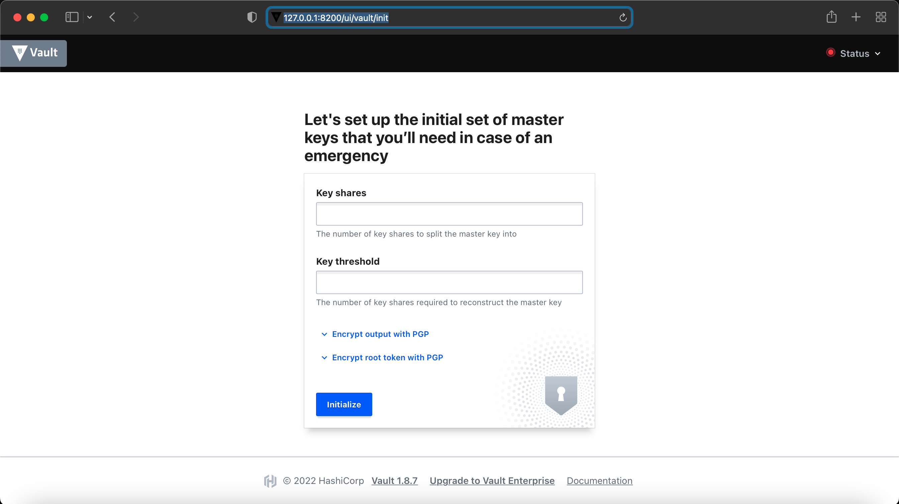
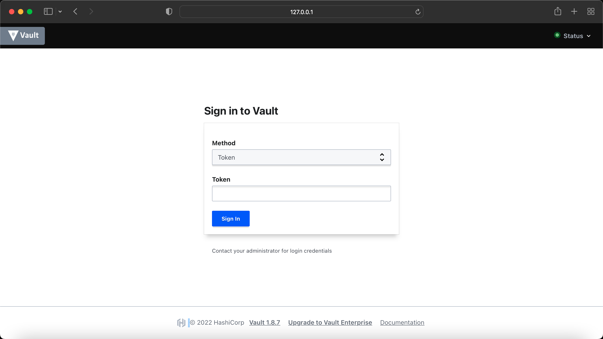
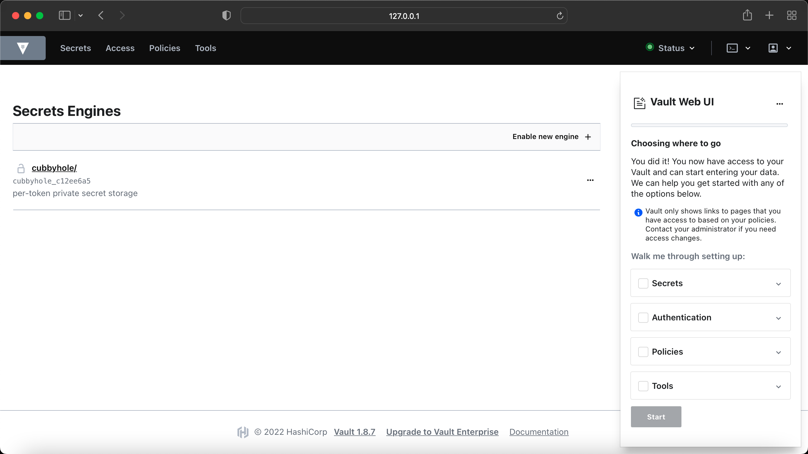

# Network Automation with Vault

## Vault Introduction

HashiCorp Vault is an identity-based secrets and encryption management system. A secret is anything that you want to tightly control access to, such as API encryption keys, passwords, and certificates. Vault provides encryption services that are gated by authentication and authorization methods. Using Vault’s UI, CLI, or HTTP API, access to secrets and other sensitive data can be securely stored and managed, tightly controlled (restricted), and auditable.

I am using Vault 1.8.7 as mentioned in DevNet Expert equipment list, however, you can download the latest version from [here](https://www.vaultproject.io/downloads) if you are interested.

The plan is to use Vault with Python, Ansible and Terraform, you may see the repo grow but for now, I will mainly be focusing on Python scripts with Vault to keep my device credentials, API keys, token etc. 

If you have your own Ubuntu server where you like to install Vault, please check [vault_on_ubuntu.md](vault_on_ubuntu.md). 

I am going to use `Vault` without TLS in this example, however you should be using `Vault` with properly signed certifcate in the production environment and if you want to see how you can use self-signed certificates, check out my [vault_on_ubuntu.md](vault_on_ubuntu.md) file. 

## HashiCorp Vault on DevNet CWS

Fortunately, Vault is already installed on DevNet CWS, all you have to do it, run the service on demand, dev mode or create a service. 

### Running Vault manually with config file
```bash
$ vault server -config=/etc/vault.d/vault.hcl
```

check out my [vault.hcl](vault_config_files/vault.hcl) file.

You may also run the Vault in Dev envrionment mode, which will provide you the unseal key and root token. Keep in mind, running Vault in dev mode changes root token every time you start the server. Hence, you may need to re-add the environment variable for root token (VAULT_TOKEN) every time you restart the server in dev mode. This is very useful if you are only testing for learning purpose. 

### Running Vault in Dev Server Mode
```bash
$ vault server -dev
```

### Running Vault via Docker 

If you have a docker installed on your system and you do not want additional service to be runnig, you can run the Vault via docker .

- To run the vault server in dev mode
```bash
$ docker pull vault
$ docker run -d -rm --name=dev-vault --cap-add=IPC_LOCK -e 'VAULT_DEV_ROOT_TOKEN_ID=my-secret-token' -e 'VAULT_DEV_LISTEN_ADDRESS=0.0.0.0:8200' -p 8200:8200 vault
```

- To run the vault server in dev mode
```bash
$ docker run -d -rm --name=vault-server --cap-add=IPC_LOCK -e 'VAULT_LOCAL_CONFIG={"backend": {"file": {"path": "/vault/file"}}, "default_lease_ttl": "168h", "max_lease_ttl": "720h"}' e 'VAULT_DEV_LISTEN_ADDRESS=0.0.0.0:8200' -p 8200:8200 vault server
```

For more information: https://hub.docker.com/_/vault

### Running Vault as a Service

Create a `vault.service` file and place it into the `/etc/systemd/system`

```bash
(main) expert@expert-cws:~$ cat vault.service 
[Unit]
Description=HashiCorp Vault Service
Requires=network-online.target
After=network-online.target
ConditionFileNotEmpty=/etc/vault.d/vault.hcl

[Service]
EnvironmentFile=-/etc/sysconfig/vault
Environment=GOMAXPROCS=2
Restart=on-failure
RestartSec=5
ExecStart=/usr/bin/vault server -config=/etc/vault.d/vault.hcl
StandardOutput=/var/log/vault/output.log
StandardError=/var/log/vault/error.log
LimitMEMLOCK=infinity
ExecReload=/bin/kill -HUP $MAINPID
KillSignal=SIGTERM
LimitNOFILE=6553

[Install]
WantedBy=multi-user.target
```

As you can see I have mentioned log files in the above service configuration, so let's also create a log directory for Vault.
```bash
$ sudo mkdir -p /var/log/vault
```

Move the `vault.service` to system deamon directory 
```bash
(main) expert@expert-cws:~$ mv vault.service /etc/systemd/system/
```

#### Start the vault service and check the status 

```bash
(main) expert@expert-cws:~$ sudo systemctl start vault.service
(main) expert@expert-cws:~$ sudo systemctl status vault.service
● vault.service - HashiCorp Vault Service
     Loaded: loaded (/etc/systemd/system/vault.service; disabled; vendor preset: enabled)
     Active: active (running) since Mon 2022-07-25 19:15:31 UTC; 2s ago
   Main PID: 228989 (vault)
      Tasks: 8 (limit: 4572)
     Memory: 16.5M
     CGroup: /system.slice/vault.service
             └─228989 /usr/bin/vault server -config=/etc/vault.d/vault.hcl

Jul 25 19:15:32 expert-cws vault[228989]:               Go Version: go1.16.12
Jul 25 19:15:32 expert-cws vault[228989]:               Listener 1: tcp (addr: "0.0.0.0:8200", cluster address: "0.0.0.0>
Jul 25 19:15:32 expert-cws vault[228989]:                Log Level: info
Jul 25 19:15:32 expert-cws vault[228989]:                    Mlock: supported: true, enabled: false
Jul 25 19:15:32 expert-cws vault[228989]:            Recovery Mode: false
Jul 25 19:15:32 expert-cws vault[228989]:                  Storage: file
Jul 25 19:15:32 expert-cws vault[228989]:                  Version: Vault v1.8.7
Jul 25 19:15:32 expert-cws vault[228989]:              Version Sha: cbb9028c136cae238727cf460229d8b8bdb0d10a
Jul 25 19:15:32 expert-cws vault[228989]: ==> Vault server started! Log data will stream in below:
Jul 25 19:15:32 expert-cws vault[228989]: 2022-07-25T19:15:32.011Z [INFO]  proxy environment: http_proxy="" https_proxy=>
(main) expert@expert-cws:~$ 
```

You may also consider to enable the service, so you dont have to start the service every time you boot up the system

```bash
$ sudo systemctl daemon-reload
$ sudo systemctl start vault.service
$ sudo systemctl enable vault.service
$ sudo systemctl status vault.service
```

It is also handy if you install auto-complete, which will help you see the command by just typing vault and tab it couple of time, it will also auto complete the command by typing first letter.  

```bash
$ vault -autocomplete-install
$ complete -C /usr/bin/vault vault
```

e.g.

```
(main) expert@expert-cws:~$ vault 
agent      debug      lease      monitor    path-help  print      server     token      
audit      delete     list       namespace  plugin     read       ssh        unwrap     
auth       kv         login      operator   policy     secrets    status     write      
(main) expert@expert-cws:~$ vault kv 
delete             enable-versioning  list               patch              rollback           
destroy            get                metadata           put                undelete   
```

#### Export vault environmental variables 

To set the variables for current session 
```bash
(main) expert@expert-cws:~$ export VAULT_ADDR='http://127.0.0.1:8200'
(main) expert@expert-cws:~$ export VAULT_API_ADDR='http://127.0.0.1:8200'
```

To make them peristent, add them to your .bashrc or .bash_profile
```bash
$ export "VAULT_ADDR=http://127.0.0.1:8200" >> ~/.bashrc 
$ export "VAULT_API_ADDR=http://127.0.0.1:8200" >> ~/.bashrc 
```

To confirm the variables exist
```bash
(main) expert@expert-cws:~$ echo $VAULT_API_ADDR
http://127.0.0.1:8200
(main) expert@expert-cws:~$ echo $VAULT_ADDR
http://127.0.0.1:8200
```

#### Check the vault status, version and help 

```s
$ vault --version
$ vault status
$ vault -h
```

```bash 
(main) expert@expert-cws:~$ vault --version
Vault v1.8.7 (cbb9028c136cae238727cf460229d8b8bdb0d10a)
```

```bash
(main) expert@expert-cws:~$ vault status
Key             Value
---             -----
Seal Type       shamir
Initialized     true
Sealed          false
Total Shares    5
Threshold       3
Version         1.8.7
Storage Type    file
Cluster Name    vault-cluster-ca49b739
Cluster ID      d5b645ad-00fa-0d02-890e-6844d4ef522f
HA Enabled      false

```bash
(main) expert@expert-cws:~$ vault -h
Usage: vault <command> [args]

Common commands:
    read        Read data and retrieves secrets
    write       Write data, configuration, and secrets
    delete      Delete secrets and configuration
    list        List data or secrets
    login       Authenticate locally
    agent       Start a Vault agent
    server      Start a Vault server
    status      Print seal and HA status
    unwrap      Unwrap a wrapped secret

Other commands:
    audit          Interact with audit devices
    auth           Interact with auth methods
    debug          Runs the debug command
    kv             Interact with Vault's Key-Value storage
    lease          Interact with leases
    monitor        Stream log messages from a Vault server
    namespace      Interact with namespaces
    operator       Perform operator-specific tasks
    path-help      Retrieve API help for paths
    plugin         Interact with Vault plugins and catalog
    policy         Interact with policies
    print          Prints runtime configurations
    secrets        Interact with secrets engines
    ssh            Initiate an SSH session
    token          Interact with tokens
(main) expert@expert-cws:~$ 
```

Finally if you browse to the url http://127.0.0.1:8200, you will see the following screen, where you have to intialize the Vault.



You can either intialize the Vault via Web UI or CLI, to intialize the Vault via Web UI, Enter 5 in the 'Key shares' and 3 in the 'Key threshold'. This is a standard to split the master key into 5 shares and can be reconstructed with 3 keys. Once you enter the values and click 'Initialize', it will pop up a file to download with these keys information, this is an important file, keep it in a safe place and it will be needed to unseal the Vault. 

#### Intialize the Vault via CLI 

`$ vault operator init`

```bash
(main) expert@expert-cws:~$ vault operator init
Unseal Key 1: GxDPlRVIiQK0RzrraaafM2YvdM5vmlr41w3Dd35KAeds
Unseal Key 2: kkwg85r0bdjFYzWfkFVAQDeq+NZzh1y8urAvQLiF0J8h
Unseal Key 3: 5L2i11/HR751I2/3uLQzpJbNBN4IH1cL/tXgD7FzeU92
Unseal Key 4: ebwgLiEaufGdbGsvVt5K3LgGAWTGZyHGuwa0ZAVpaKeJ
Unseal Key 5: 6JlGvlUed24Ovo5ceuXTDsLM1xsj/R23XPVCS5sJqoud

Initial Root Token: s.AAEWXJTWImihghhsrPwU7B1R

Vault initialized with 5 key shares and a key threshold of 3. Please securely
distribute the key shares printed above. When the Vault is re-sealed,
restarted, or stopped, you must supply at least 3 of these keys to unseal it
before it can start servicing requests.

Vault does not store the generated master key. Without at least 3 keys to
reconstruct the master key, Vault will remain permanently sealed!

It is possible to generate new unseal keys, provided you have a quorum of
existing unseal keys shares. See "vault operator rekey" for more information.
```

You need to keep this information safe as if Vault stops or restart, it will need this information to unseal the Vault. You may also re-key or re-initialze Vault but be careful you may loose the data. 

It is also a good practice to save the root token into the environment variable to avoid typing over and over again. 

`$ export VAULT_TOKEN=s.AAEWXJTWImihghhsrPwU7B1R`

#### Unseal the Vault via command line 

__Showing this as demo purpose only and I will re-initialize my keys for security reason.__

As discussed before, we require minimum 3 keys to reconstruct master key and same required to unseal Vault.

Run the following command 3 times and enter a different key each time.

`$ vault operator unseal`

Or run the following command 3 times with 3 different keys.

`$ vault operator unseal GxDPlRVIiQK0RzrraaafM2YvdM5vmlr41w3Dd35KAeds`

```bash
(main) expert@expert-cws:~$ vault operator unseal
Unseal Key (will be hidden): 
Key                Value
---                -----
Seal Type          shamir
Initialized        true
Sealed             true
Total Shares       5
Threshold          3
Unseal Progress    1/3
Unseal Nonce       6344453d-9177-0639-545b-29e52e6b1f77
Version            1.8.7
Storage Type       file
HA Enabled         false
(main) expert@expert-cws:~$ vault operator unseal
Unseal Key (will be hidden): 
Key                Value
---                -----
Seal Type          shamir
Initialized        true
Sealed             true
Total Shares       5
Threshold          3
Unseal Progress    2/3
Unseal Nonce       6344453d-9177-0639-545b-29e52e6b1f77
Version            1.8.7
Storage Type       file
HA Enabled         false
(main) expert@expert-cws:~$ vault operator unseal
Unseal Key (will be hidden): 
Key             Value
---             -----
Seal Type       shamir
Initialized     true
Sealed          false
Total Shares    5
Threshold       3
Version         1.8.7
Storage Type    file
Cluster Name    vault-cluster-ca49b739
Cluster ID      d5b645ad-00fa-0d02-890e-6844d4ef522f
HA Enabled      false
(main) expert@expert-cws:~$ 
```

On the last key output, you can see `Sealed   false` and `Threshold   3` which means Vault has been unsealed now and ready to get login. 

#### Login to Vault 

You can now login to Vault either via Web UI or CLI. 

Here is what it looks like when you login via Web UI, you need to select 'Token' for the 'Method' and enter the root token we generated when we initialized the Vault in the earlier step.  



__To Login via CLI__

Simply type `vault login`, it will prompt you for the token, enter the root token we generated when we initialized the Vault before.

```bash
(main) expert@expert-cws:~$ vault login
Token (will be hidden): 
Success! You are now authenticated. The token information displayed below
is already stored in the token helper. You do NOT need to run "vault login"
again. Future Vault requests will automatically use this token.

Key                  Value
---                  -----
token                s.AAEWXJTWImihghhsrPwU7B1R
token_accessor       N6q3r5SiF2bTQyIyyPE3EWmL
token_duration       ∞
token_renewable      false
token_policies       ["root"]
identity_policies    []
policies             ["root"]
(main) expert@expert-cws:~$ 
```

We now have successfully brought the Vault service up and running, next step is to create your first secret. Check out [secrets_with_vault.md](secrets_with_vault.md).

There is another mode available for Vault, which I haven't discussed here, it is called High Availability (HA) Mode but you can find the details [here](https://www.vaultproject.io/docs/concepts/ha).

Here is how the initial dashboard looks like in Vault UI, before you create any new secrets.

 

#### HVAC (HashiCorp Vault API client)

HVAC library is created by Hashicorp for Python3.x which can be installed via pip `pip install hvac`. Read the hvac documentation [here](https://hvac.readthedocs.io/en/stable/overview.html).

I have created a folder for python scripts with vault, see the folder [vault-python-scripts](vault-python-scripts).

## Author

[Muhammad Rafi](https://www.linkedin.com/in/muhammad-rafi-0a37a248/)

## References

_https://www.vaultproject.io/docs/what-is-vault_

_https://www.vaultproject.io/downloads_

_https://www.vaultproject.io/docs/install_

_https://learn.hashicorp.com/tutorials/vault/getting-started-install_

_https://developer.cisco.com/codeexchange/github/repo/CiscoDevNet/vault_

_https://hvac.readthedocs.io/en/stable/index.html_


