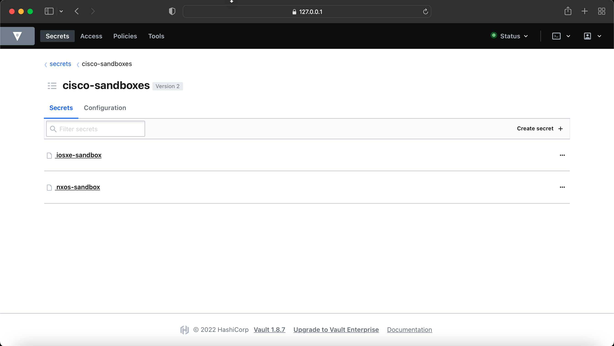
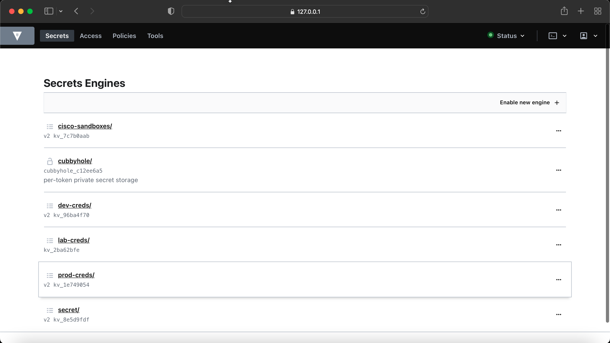
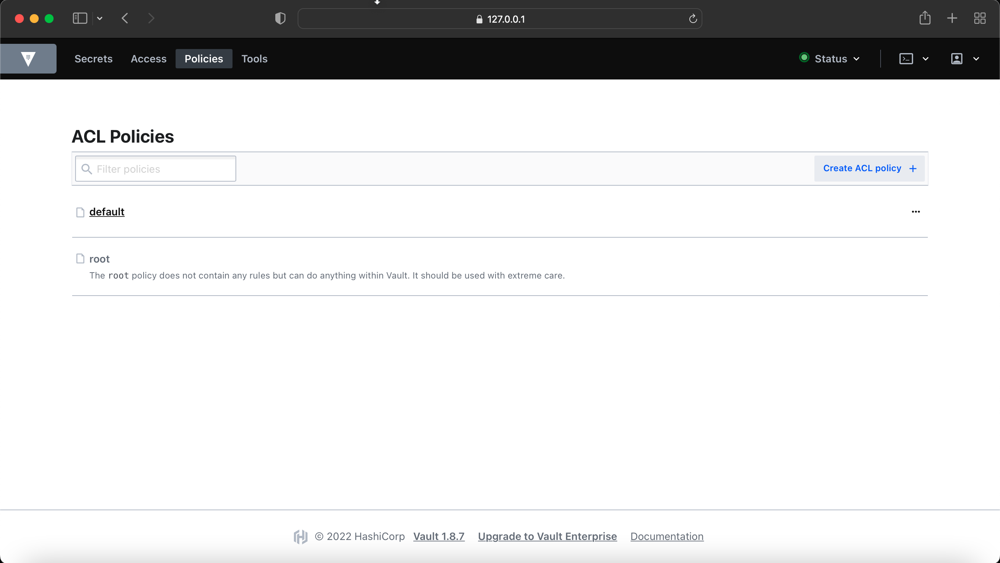
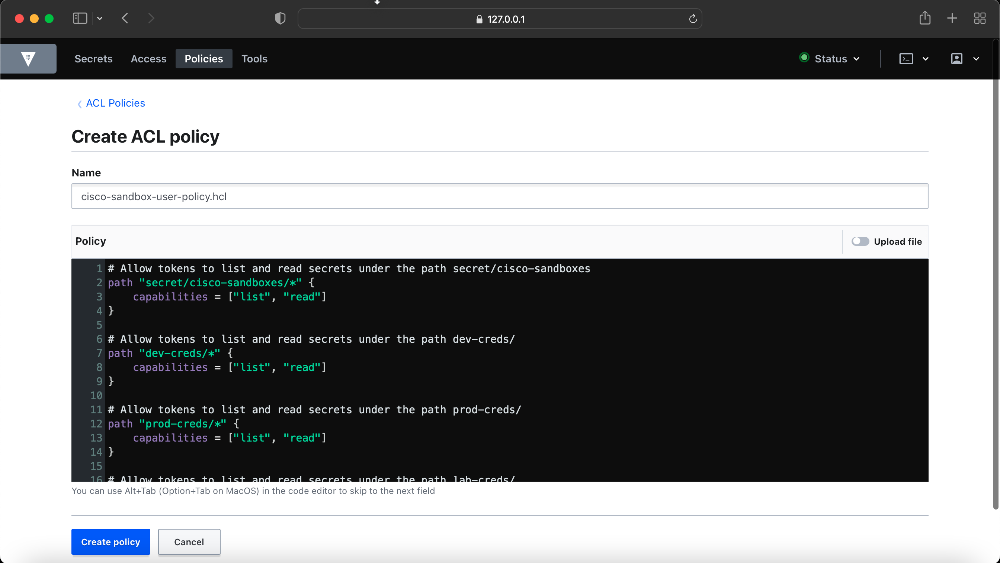
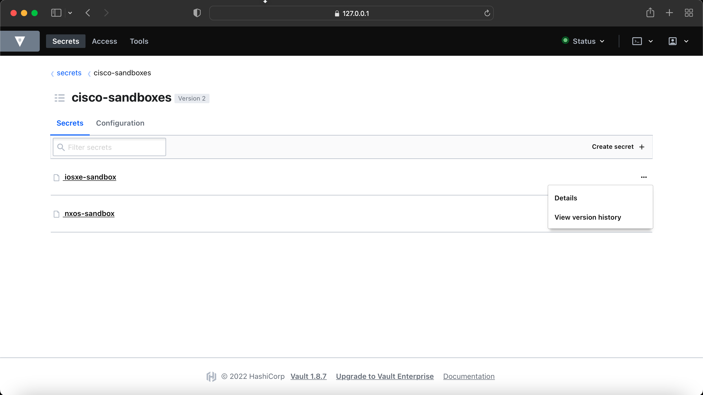
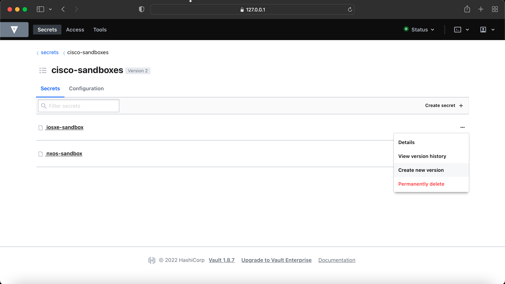

# Creating Vault Policies via Vault Command Line Interface

## Introduction
In Vault, everyting is path-based whether you are talking about secrets, auth, policies etc. Therefore, policies in the Vault uses same concept and provides a declarative way to allow or deny access based on the paths users or entities are trying to access. 

Policies are deny by default, so an empty policy grants no permission in the system. for more information, please check out this [link](https://www.vaultproject.io/docs/concepts/policies).

As Vault is a Hashicorp product, we write configuration files in HashiCorp Configuration Language (HCL), therefore, if you want to create Vault policies, you need to write a file in `HCL`, however `JSON` is also possible. See the example below, we are creating a policy for a user, who can access certain paths with the capabilities defined in the array. 

```s
path "secret/*" {
  		capabilities = ["list"]
}
path "secret/data/nxos-creds/*" {
  		capabilities = ["list", "read", "create", "update", "patch", "delete"]
}
path "secret/metadata" {
  		capabilities = ["list"]
}
```

We cannot use "patch" capability as it was introduced in version 1.9 and we are using 1.8.7 

If we apply above policy for a user, then that user will only be able to list anything `secret/*` and do pretty much everything for the path `secret/data/nxos-creds/*`.

## Capabilities
Each path must define one or more capabilities which provide fine-grained control over permitted (or denied) operations. As shown in the examples above, capabilities are always specified as a list of strings, even if there is only one capability.

To determine the capabilities needed to perform a specific operation, the -output-policy flag can be added to the CLI subcommand. For an example, refer to the Print Policy [Requirements](https://www.vaultproject.io/docs/commands#print-policy-requirements) document section.

The list of capabilities include the following:

- __create (POST/PUT)__ - Allows creating data at the given path. Very few parts of Vault distinguish between create and update, so most operations require both create and update capabilities. Parts of Vault that provide such a distinction are noted in documentation.

- __read (GET)__ - Allows reading the data at the given path.

- __update (POST/PUT)__ - Allows changing the data at the given path. In most parts of Vault, this implicitly includes the ability to create the initial value at the path.

- __patch (PATCH)__ - Allows partial updates to the data at a given path.

- __delete (DELETE)__ - Allows deleting the data at the given path.

- __list (LIST)__ - Allows listing values at the given path. Note that the keys returned by a list operation are not filtered by policies. Do not encode sensitive information in key names. Not all backends support listing.

This information is taken from this Vault docs [Capabilities](https://www.vaultproject.io/docs/concepts/policies).

## Demo Time
Let's create two policies and see how does these policies effect the access. 

In this example I am creating two policies for two users, who can access the following `cisco-sandboxes` under `secret/` as well as other mount_ponts. 




Two users polices will be created as follow 

1. __cisco-sandbox-user-policy.hcl__
2. __cisco-sandbox-admin-policy.hcl__

'cisco-sandbox-user' will only have list and read access but 'cisco-sandbox-admin' will have all the access, (list, read, create, update, patch, delete) 

Before you create any new policy, check there is default policies available in Vault by default. 

```s
(main) expert@expert-cws:~$ vault policy list
default
root
(main) expert@expert-cws:~$ 
```

You can create polices in two ways, either you can write on the UI directly in the textbox given or upload a file. You can create a file via command line as well and place into a folder, in my case I am creating a policy file in my Vault folder. 

```s
(main) expert@expert-cws:~/vault$ pwd
/home/expert/vault
(main) expert@expert-cws:~/vault$ 
```

I am using `vi` but you can use any other editor or even notepad to create policy file but make sure save it with the .hcl extension.

`$ vi cisco-sandbox-user-policy.hcl`

```s
(main) expert@expert-cws:~/vault$ cat cisco-sandbox-user-policy.hcl
# Allow tokens to list and read secrets under the path secret/cisco-sandboxes
path "secret/cisco-sandboxes/*" {
    capabilities = ["list", "read"]
}

# Allow tokens to list and read secrets under the path secret/*
path "secret/*" {
    capabilities = ["list", "read"]
}

# Allow tokens to list and read secrets under the path dev-creds/
path "dev-creds/*" {
    capabilities = ["list", "read"]
}

# Allow tokens to list and read secrets under the path prod-creds/
path "prod-creds/*" {
    capabilities = ["list", "read"]
}

# Allow tokens to list and read secrets under the path lab-creds/
path "lab-creds/*" {
    capabilities = ["list", "read"]
}
(main) expert@expert-cws:~/vault$ 
```

Let's write this policy to the vault and then list the policies

```s
$ vault policy write cisco-sandbox-user-policy cisco-sandbox-user-policy.hcl
(main) expert@expert-cws:~/vault$ vault policy write cisco-sandbox-user-policy cisco-sandbox-user-policy.hcl
Success! Uploaded policy: cisco-sandbox-user-policy
(main) expert@expert-cws:~/vault$ vault policy list 
cisco-sandbox-user-policy
default
root
(main) expert@expert-cws:~/vault$ 
```

As you can see, the new policy `cisco-sandbox-user-policy` is showing up in the policy list. 
You can also read the content of the policy by using this command. 

`$ vault policy read cisco-sandbox-user-policy`

You can do the samething in UI, go to `Policies > ACL Policies`, click on `Create ACL Policy +`

Enter the name of the policy in `Name` field and paste the above policy we created in to the `Policy` field and once ready click on `Create Policy` to submit the policy. 





Let's create `cisco-sandbox-admin-policy` and write the policy directly via vault command using EOF (end-of-file)

```s
(main) expert@expert-cws:~/vault$ vault policy write cisco-sandbox-admin-policy - << EOF
> # Allow tokens to list and read secrets under the path cisco-sandboxes
> path "cisco-sandboxes/*" {
>     capabilities = ["list", "read", "create", "update", "delete"]
> }
>
> # Allow tokens to list and read secrets under the path secret/*
> path "secret/*" {
>     capabilities = ["list", "read", "create", "update", "delete"]
> }
> 
> # Allow tokens to list and read secrets under the path dev-creds/
> path "dev-creds/*" {
>     capabilities = ["list", "read", "create", "update", "delete"]
> }
> 
> # Allow tokens to list and read secrets under the path prod-creds/
> path "prod-creds/*" {
>     capabilities = ["list", "read", "create", "update", "delete"]
> }
> 
> # Allow tokens to list and read secrets under the path lab-creds/
> path "lab-creds/*" {
>     capabilities = ["list", "read", "create", "update", "delete"]
> }
> EOF
Success! Uploaded policy: cisco-sandbox-admin-policy
(main) expert@expert-cws:~/vault$ 
```

As you can see the success message, policy has been uploaded, check the policy list 

(main) expert@expert-cws:~/vault$ vault policy list 
cisco-sandbox-admin-policy
cisco-sandbox-user-policy
default
root

To delete the policy, deleting for demo purose, but will create it again with EOF. 
```s
(main) expert@expert-cws:~/vault$ vault policy delete cisco-sandbox-admin-policy.hcl 
Success! Deleted policy: cisco-sandbox-admin.hcl
(main) expert@expert-cws:~/vault$ 
```

Now, we need to create either two users or tokens where we attach these policies, for users account, we need to enable the another auth method 'Username & Password' but for tokens, we just run one command, so I will be covering Token method to make it quick. 

```s
vault token create -format=json -policy="cisco-sandbox-admin-policy"
vault token create -format=json -policy="cisco-sandbox-user-policy"
```

```s
(main) expert@expert-cws:~/vault$ vault token create -format=json -policy="cisco-sandbox-admin-policy"
{
  "request_id": "fdf9be76-1786-4cc4-9335-3124a41b8707",
  "lease_id": "",
  "lease_duration": 0,
  "renewable": false,
  "data": null,
  "warnings": null,
  "auth": {
    "client_token": "s.b2YnhztjWQRjaAh3MQzYtW9b",
    "accessor": "vze2UPjwZdvVdDoaXqd1qkqw",
    "policies": [
      "cisco-sandbox-admin-policy",
      "default"
    ],
    "token_policies": [
      "cisco-sandbox-admin-policy",
      "default"
    ],
    "identity_policies": null,
    "metadata": null,
    "orphan": false,
    "entity_id": "",
    "lease_duration": 2764800,
    "renewable": true
  }
}
(main) expert@expert-cws:~/vault$ 
```

```s
(main) expert@expert-cws:~/vault$ vault token create -format=json -policy="cisco-sandbox-user-policy"
{
  "request_id": "ddd9d9a6-e808-aef5-4c2a-eb3391880dbb",
  "lease_id": "",
  "lease_duration": 0,
  "renewable": false,
  "data": null,
  "warnings": null,
  "auth": {
    "client_token": "s.Jw0L6NmFyT9pYKQRTLcOxG9g",
    "accessor": "8yqWu1szMSQwUb4huNNvSjFh",
    "policies": [
      "cisco-sandbox-user-policy",
      "default"
    ],
    "token_policies": [
      "cisco-sandbox-user-policy",
      "default"
    ],
    "identity_policies": null,
    "metadata": null,
    "orphan": false,
    "entity_id": "",
    "lease_duration": 2764800,
    "renewable": true
  }
}
(main) expert@expert-cws:~/vault$ 
```

Now, we have two Tokens are created with two different policies attachments. Let's login to the vault and verify we have correct access. 

I am going to first login with the 'cisco-sandbox-user-policy' token. 

Note: Before you login make sure, you unset the VAULT_TOKEN if you have root token set. 
`$ unset VAULT_TOKEN` otherwise you will see the following message.

```s
(main) expert@expert-cws:~/vault$ vault login 
Token (will be hidden): 
WARNING! The VAULT_TOKEN environment variable is set! This takes precedence
over the value set by this command. To use the value set by this command,
unset the VAULT_TOKEN environment variable or set it to the token displayed
below.

Success! You are now authenticated. The token information displayed below
is already stored in the token helper. You do NOT need to run "vault login"
again. Future Vault requests will automatically use this token.

Key                  Value
---                  -----
token                s.Jw0L6NmFyT9pYKQRTLcOxG9g
token_accessor       8yqWu1szMSQwUb4huNNvSjFh
token_duration       767h43m9s
token_renewable      true
token_policies       ["cisco-sandbox-user-policy" "default"]
identity_policies    []
policies             ["cisco-sandbox-user-policy" "default"]
(main) expert@expert-cws:~/vault$ 
```

I have now unset the VAULT_TOKEN, let's login again and verify it with `vautl token lookup` command

```s
(main) expert@expert-cws:~/vault$ vault login 
Token (will be hidden): 
Success! You are now authenticated. The token information displayed below
is already stored in the token helper. You do NOT need to run "vault login"
again. Future Vault requests will automatically use this token.

Key                  Value
---                  -----
token                s.Jw0L6NmFyT9pYKQRTLcOxG9g
token_accessor       8yqWu1szMSQwUb4huNNvSjFh
token_duration       767h36m59s
token_renewable      true
token_policies       ["cisco-sandbox-user-policy" "default"]
identity_policies    []
policies             ["cisco-sandbox-user-policy" "default"]
(main) expert@expert-cws:~/vault$ 
(main) expert@expert-cws:~/vault$ 
(main) expert@expert-cws:~/vault$ 
```

```s
(main) expert@expert-cws:~/vault$ vault token lookup 
Key                  Value
---                  -----
accessor             8yqWu1szMSQwUb4huNNvSjFh
creation_time        1662746577
creation_ttl         768h
display_name         token
entity_id            n/a
expire_time          2022-10-11T18:02:57.392315793Z
explicit_max_ttl     0s
id                   s.Jw0L6NmFyT9pYKQRTLcOxG9g
issue_time           2022-09-09T18:02:57.536884405Z
last_renewal         2022-09-09T18:24:34.392315928Z
last_renewal_time    1662747874
meta                 <nil>
num_uses             0
orphan               false
path                 auth/token/create
policies             [cisco-sandbox-user-policy default]
renewable            true
ttl                  767h35m8s
type                 service
(main) expert@expert-cws:~/vault$ 
```
Looks good ? you can see above, the `policies` showing `[cisco-sandbox-user-policy default]` which means we are logged in via right token and the right policy is associated. 

Now let's try to read and write the secret with this Token, Read should be allowed and write should be denied as per our policy for this Token. 

```s
(main) expert@expert-cws:~/vault$ vault kv get -version=2 -format=json cisco-sandboxes/iosxe-sandbox 
{
  "request_id": "3249791c-a714-4b62-c80e-00566bd895f0",
  "lease_id": "",
  "lease_duration": 0,
  "renewable": false,
  "data": {
    "data": {
      "iosxe_password": "C1sco12345",
      "iosxe_username": "developer"
    },
    "metadata": {
      "created_time": "2022-09-08T12:33:03.400330855Z",
      "deletion_time": "",
      "destroyed": false,
      "version": 2
    }
  },
  "warnings": null
}
(main) expert@expert-cws:~/vault$ 
```

```s
(main) expert@expert-cws:~/vault$ vault kv put -format=json cisco-sandboxes/iosxe-sandbox new_username=admin 
Error writing data to cisco-sandboxes/data/iosxe-sandbox: Error making API request.

URL: PUT https://localhost:8200/v1/cisco-sandboxes/data/iosxe-sandbox
Code: 403. Errors:

* 1 error occurred:
	* permission denied


(main) expert@expert-cws:~/vault$ 
```

As you can see we read the secret fine but when we try to create or update the secret, it throws the 403 (HTTP Code Forbidden Error) and says permission denied. which is expected output, so we can surely say our `cisco-sandbox-user-policy` working fine. 

Now, let's login with the Token which has `cisco-sandbox-admin-policy` attached and only try to run the same command to update the secret. 


```s
(main) expert@expert-cws:~/vault$ vault login 
Token (will be hidden): 
Success! You are now authenticated. The token information displayed below
is already stored in the token helper. You do NOT need to run "vault login"
again. Future Vault requests will automatically use this token.

Key                  Value
---                  -----
token                s.b2YnhztjWQRjaAh3MQzYtW9b
token_accessor       vze2UPjwZdvVdDoaXqd1qkqw
token_duration       762h19m54s
token_renewable      true
token_policies       ["cisco-sandbox-admin-policy" "default"]
identity_policies    []
policies             ["cisco-sandbox-admin-policy" "default"]
(main) expert@expert-cws:~/vault$ vault token lookup 
Key                  Value
---                  -----
accessor             vze2UPjwZdvVdDoaXqd1qkqw
creation_time        1662746538
creation_ttl         768h
display_name         token
entity_id            n/a
expire_time          2022-10-11T18:02:18.655073054Z
explicit_max_ttl     0s
id                   s.b2YnhztjWQRjaAh3MQzYtW9b
issue_time           2022-09-09T18:02:18.296086545Z
last_renewal         2022-09-09T23:29:53.655085803Z
last_renewal_time    1662766193
meta                 <nil>
num_uses             0
orphan               false
path                 auth/token/create
policies             [cisco-sandbox-admin-policy default]
renewable            true
ttl                  762h19m42s
type                 service
(main) expert@expert-cws:~/vault$ 
```

```s
(main) expert@expert-cws:~/vault$ vault kv put -format=json cisco-sandboxes/iosxe-sandbox new_username=admin 
{
  "request_id": "6e83be08-5ad3-1a1f-7efa-4456115d8a2d",
  "lease_id": "",
  "lease_duration": 0,
  "renewable": false,
  "data": {
    "created_time": "2022-09-09T23:43:25.799918508Z",
    "deletion_time": "",
    "destroyed": false,
    "version": 4
  },
  "warnings": null
}
(main) expert@expert-cws:~/vault$ 
```

```s
(main) expert@expert-cws:~/vault$ vault kv get -version=4 -format=json cisco-sandboxes/iosxe-sandbox 
{
  "request_id": "9ad407b1-65c5-68a2-4acc-0fc266336fc3",
  "lease_id": "",
  "lease_duration": 0,
  "renewable": false,
  "data": {
    "data": {
      "new_username": "admin"
    },
    "metadata": {
      "created_time": "2022-09-09T23:43:25.799918508Z",
      "deletion_time": "",
      "destroyed": false,
      "version": 4
    }
  },
  "warnings": null
}
(main) expert@expert-cws:~/vault$ 
```

There you go! you can see from the above outputs, `cisco-sandbox-admin-policy` is allowing the Token to read and create both permissions as well as the other ones which we havent tested but they should work too. 

If you want to check this on UI, see below screenshot for both the policies where I logged to the Vault UI both token and see different options showing for the secret. 

Logged in to the Vault via Token attached with `cisco-sandbox-user-policy`


Logged in to the Vault via Token attached with `cisco-sandbox-admin-policy`


In this example, I have only scratched the surface but you can alot more with Vault policies and go even more granular, please see the links in the Reference section below for further read. 

## References:
[Policies](https://www.vaultproject.io/docs/concepts/policies)
[Vault Policies](https://learn.hashicorp.com/tutorials/vault/policies)
