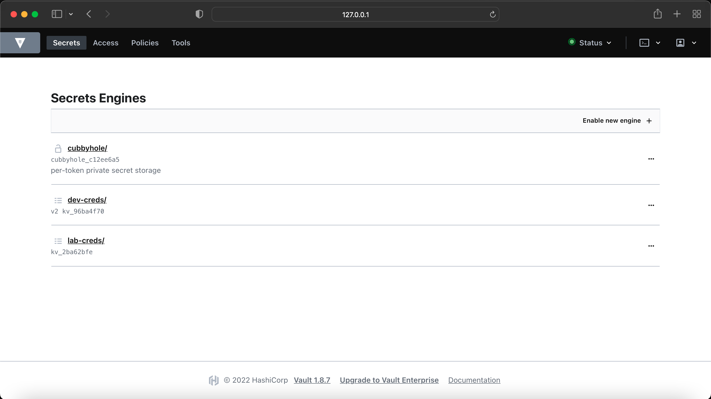

# Creating Secrets via Vault Command Line Interface

## Introduction
Secrets are nothing but the user/device or system passwords, ssh/API keys, auth tokens etc. By using vault, you can manage your secrets in devops fasion, where you can include them in your scripts and simply calling them via Vault APIs. 

There are multiple way to create secrets and there are many types of secret engines available in Vault, for more details on Secret Engines, please see the References links below on the bottom of page. 

You can add,remove, edit or delete/disable secrets in three ways, Web UI, CLI or APIs. In this example, I will be showing you only how to play with secrets via CLI method. 

Since, we are working with network devices, we normally use username, passwords, SSH/API keys or Tokens. Hence the `kv` Secret Engine is the best choice and we will creating secrets with this kv Secret Engine.

The kv secrets engine is used to store arbitrary secrets within the configured physical storage for Vault.

KV or Key/Value secrets engine has version 1 and 2. The difference is that v2 provides versioning of secrets and v1 does not.

I will mostly be working with Key/Value secrets engine version2 `kv-2` but I will also show you the version1 as well. 

### Create KV Secret Engine using kv-v1 and kv-v2

First of all, enable new secret engine 'kv' with version1 and create a path for lab-creds, where you can save you secrets.

```bash
(main) expert@expert-cws:~$ vault secrets enable -path=lab-creds kv
Success! Enabled the kv secrets engine at: lab-creds/
(main) expert@expert-cws:~$ 
```

Now let's enable another secret engine 'kv' with version2 and create a path for dev-creds.

```bash
(main) expert@expert-cws:~$ vault secrets enable -path="dev-creds" kv-v2
Success! Enabled the kv-v2 secrets engine at: dev-creds/
(main) expert@expert-cws:~$ 
```

Check the if the paths are created for both versions

```bash
(main) expert@expert-cws:~$ vault secrets list
Path          Type         Accessor              Description
----          ----         --------              -----------
cubbyhole/    cubbyhole    cubbyhole_c12ee6a5    per-token private secret storage
dev-creds/    kv           kv_96ba4f70           n/a
identity/     identity     identity_8f133c0a     identity store
lab-creds/    kv           kv_2ba62bfe           n/a
sys/          system       system_a594cbfb       system endpoints used for control, policy and debugging
(main) expert@expert-cws:~$ 
```

Notice, we have two new paths for `kv` secret engine are ebaled, though the type showing same but we can also check via UI to verify they have different versions. 

 

Here you can see 'dev-creds' showing v2. 

### Storing Secrets(device credentials) inside KV Secret Engine using kv-v1 and kv-v2

Add new secrets under the newly created path 'lab-creds' and name them as `iosxe-creds` and `iosxr-creds` with the username and password key value pairs. This uses kv secret engine version1.

```bash
(main) expert@expert-cws:~$ vault kv put lab-creds/iosxe-creds username=admin password=C1sco123
Success! Data written to: lab-creds/iosxe-creds
(main) expert@expert-cws:~$ vault kv put lab-creds/iosxr-creds username=admin password=C1sco123
Success! Data written to: lab-creds/iosxr-creds
(main) expert@expert-cws:~$ 
```

Let's add another secret under kv secret engine path `dev-creds` which uses version2. 

```bash
(main) expert@expert-cws:~$ vault kv put dev-creds/nxos-creds username=cisco password=cisco
Key              Value
---              -----
created_time     2022-07-27T18:42:02.421462446Z
deletion_time    n/a
destroyed        false
version          1
(main) expert@expert-cws:~$ 
```

You can see the difference in the both secret engine versions output, kv secret engine version2 shows detailed output and also showing version of the secret which is one of the  difference between kv-v1 and kv-v2. Do not confuse with this `version 1` in the above output as this is showing the version of the secret(credentials) we created just now and will be version controlled as we make changes to this secret. This is not `kv` secret engine version.

### Showing the secrets via `kv get` command 

```bash
(main) expert@expert-cws:~$ vault kv get lab-creds/iosxe-creds
====== Data ======
Key         Value
---         -----
password    C1sco123
username    admin
(main) expert@expert-cws:~$ vault kv get lab-creds/iosxr-creds
====== Data ======
Key         Value
---         -----
password    C1sco123
username    admin
```

You can also use `-output-curl-string` command to print an equivalent cURL command string for any vault command, which will be helpful for the API call. 

```bash
(main) expert@expert-cws:~$ vault kv get -output-curl-string lab-creds/iosxr-creds
curl -H "X-Vault-Token: $(vault print token)" -H "X-Vault-Request: true" http://127.0.0.1:8200/v1/lab-creds/iosxr-creds
(main) expert@expert-cws:~$ 
(main) expert@expert-cws:~$ vault kv get -output-curl-string dev-creds/nxos-creds
curl -H "X-Vault-Token: $(vault print token)" -H "X-Vault-Request: true" http://127.0.0.1:8200/v1/dev-creds/data/nxos-creds
(main) expert@expert-cws:~$
```

Use these output of the cURL command and a run GET API request to retrieve the secrets. which can be useful if you are writing a python scripts and use this API call to retrieve the secrets and use them to access the device. 

kv version 1 API call 

```bash
(main) expert@expert-cws:~$ curl -H "X-Vault-Token: $(vault print token)" -H "X-Vault-Request: true" http://127.0.0.1:8200/v1/lab-creds/iosxr-creds | jq
  % Total    % Received % Xferd  Average Speed   Time    Time     Time  Current
                                 Dload  Upload   Total   Spent    Left  Speed
100   206  100   206    0     0  22888      0 --:--:-- --:--:-- --:--:-- 22888
{
  "request_id": "9444ddbe-aae4-2620-29d7-2c13a01bb4aa",
  "lease_id": "",
  "renewable": false,
  "lease_duration": 2764800,
  "data": {
    "password": "C1sco123",
    "username": "admin"
  },
  "wrap_info": null,
  "warnings": null,
  "auth": null
}
(main) expert@expert-cws:~$ 
```

kv version 2 API call 

```bash
(main) expert@expert-cws:~$ curl -H "X-Vault-Token: $(vault print token)" -H "X-Vault-Request: true" http://127.0.0.1:8200/v1/dev-creds/data/nxos-creds | jq
  % Total    % Received % Xferd  Average Speed   Time    Time     Time  Current
                                 Dload  Upload   Total   Spent    Left  Speed
100   316  100   316    0     0  31600      0 --:--:-- --:--:-- --:--:-- 31600
{
  "request_id": "44ccf57c-19c3-82a8-ea6e-e9551aba2e79",
  "lease_id": "",
  "renewable": false,
  "lease_duration": 0,
  "data": {
    "data": {
      "password": "cisco",
      "username": "cisco"
    },
    "metadata": {
      "created_time": "2022-07-27T18:42:02.421462446Z",
      "deletion_time": "",
      "destroyed": false,
      "version": 1
    }
  },
  "wrap_info": null,
  "warnings": null,
  "auth": null
}
(main) expert@expert-cws:~$ 
```

You may notice both API calls have different URLs as well as different output, kv-v1 uses `/lab-creds/iosxr-creds` and kv-v2 `/dev-creds/data/nxos-creds`, therefore, we need to be mindful when making an API call against the different version of kv secret engines. 

In this example, I have only sctrached the surface for the Vault, however there are alot of things you can do with this, for example, you can also create access policies using the ACL, where you can restrict the access.

You can also list the secrets under the specific path 

```bash
(main) expert@expert-cws:~$ vault kv list lab-creds
Keys
----
iosxe-creds
iosxr-creds
(main) expert@expert-cws:~$ vault kv list dev-creds
Keys
----
nxos-creds
(main) expert@expert-cws:~$ 
```

You also use `json` output format along with `json query | jq` to display the colorful output.

```bash
(main) expert@expert-cws:~$ vault kv get -version=1 -format=json dev-creds/nxos-creds | jq
(main) expert@expert-cws:~$ vault kv get -format=json lab-creds/iosxe-creds | jq
```

 
 

If you are interested to see the meta data for the secrets, run the following command, please note, this only works with version 2. You can see the in the blow output for the kv-v1 output `Metadata not supported on KV Version 1`

```bash
(main) expert@expert-cws:~$ vault kv metadata get -format=json dev-creds/nxos-creds  | jq
(main) expert@expert-cws:~$ vault kv metadata get -format=json lab-creds/iosxe-creds  | jq
```

 

### Deleting/destroying the secrets 

```
$ vault kv delete lab-creds/iosxr
$ vault kv delete -path=database-creds kv
```

### kv secrets engine - version 1 vs 2

Key/Value secrets engine has version 1 and 2. The difference is that v2 provides versioning of secrets and v1 does not.

Use the vault kv _<subcommand_> [options] [args] command to interact with K/V secrets engine.

| Subcommand        | kv v1	| kv v2	| Description                                           |
|:-----------------:|:-----:|:------|:-----------------------------------------------------:|
| delete	          | x	    | x	    | Delete versions of secrets stored in K/V              |
| destroy		        |       | x	    | Permanently remove one or more versions of secrets    |
| enable-versioning	|	      | x	    | Turns on versioning for an existing K/V v1 store      |
| get	              | x	    | x	    | Retrieve data                                         |
| list	            | x	    | x	    | List data or secrets                                  |
| metadata		      |       | x	    | Interact with Vault's Key-Value storage               | 
| patch	    	      |       | x	    | Update secrets without overwriting existing secrets   |

In addition, KV v2 has additional subcommands that are not available for KV v1.

|   Command	         |       KV v2 endpoint          |
|:------------------:|:-----------------------------:|
| vault kv patch	   |   secret/data/<key_path>      |
| vault kv rollback	 |   secret/data/<key_path>      |
| vault kv undelete	 |   secret/undelete/<key_path>  |
| vault kv destroy	 |   secret/destroy/<key_path>   |
| vault kv metadata	 |   /metadata/<key_path>        |


## References
[Starting the Dev Server](https://learn.hashicorp.com/tutorials/vault/getting-started-dev-server?in=vault/getting-started)

[Secrets Engines](https://learn.hashicorp.com/tutorials/vault/getting-started-secrets-engines)

[KV Secrets Engine](https://www.vaultproject.io/docs/secrets/kv)

[KV Secrets Engine - Version 2](https://www.vaultproject.io/docs/secrets/kv/kv-v2)

[Your First Secret](https://learn.hashicorp.com/tutorials/cloud/vault-first-secrets)

[Compare Key/Value Secrets Engine v1 and v2](https://learn.hashicorp.com/tutorials/vault/compare-kv-versions?in=vault/secrets-management)

